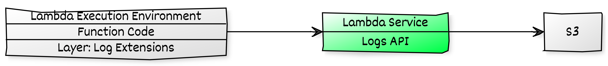

# AWS Lambda extensions: Send logs to custom destinations - S3

Mystique Unicorn app is generating lot of logs. They are looking to aggregate the logs to a centralized location for further processing and archival needs. Currently their AWS lambda functions logs are collected in cloudwatch and using another lambda they are pushing them to S3. Recently AWS announced lambda logs API<sup>[1]</sup> which allows you to use push lambda logs to custom destination, like for example S3 or ElasticSearch.

Can you help them with a proof of concept, to show them how to send their lambda logs to S3 using the lambda logs API?

## 🎯 Solutions

The Logs API uses Lambda extensions<sup>[1]</sup> underneath to achieve this functionality. A Lambda extension can subscribe to log streams directly from within the Lambda execution environment. They can enable the subscription by sending a subscription request to the Logs API. Once you do that, Lambda streams the logs to the extension, and the extension can then process, filter, and send the logs to any preferred destination.

The Logs API allows extensions to subscribe to three different logs streams:
 - Function logs that the Lambda function generates and writes to `stdout` or `stderr`.
 - Lambda platform logs, such as the `START`, `END`, and `REPORT` logs.
 - Extension logs that extension code generates.(_Note: Take care when sending your extension log_)



In this article, we will build an architecture, similar to the one shown above. We will start backwards so that all the dependencies are satisfied.

1.  ## 🧰 Prerequisites

    This demo, instructions, scripts and cloudformation template is designed to be run in `us-east-1`. With few modifications you can try it out in other regions as well(_Not covered here_).

    - 🛠 AWS CLI Installed & Configured - [Get help here](https://youtu.be/TPyyfmQte0U)
    - 🛠 AWS CDK Installed & Configured - [Get help here](https://www.youtube.com/watch?v=MKwxpszw0Rc)
    - 🛠 Python Packages, _Change the below commands to suit your OS, the following is written for amzn linux 2_
      - Python3 - `yum install -y python3`
      - Python Pip - `yum install -y python-pip`
      - Virtualenv - `pip3 install virtualenv`

1.  ## ⚙️ Setting up the environment

    - Get the application code

      ```bash
      git clone https://github.com/miztiik/lambda-logs-to-s3-with-extensions
      cd lambda-logs-to-s3-with-extensions
      ```

1.  ## 🚀 Prepare the dev environment to run AWS CDK

    We will use `cdk` to make our deployments easier. Lets go ahead and install the necessary components.

    ```bash
    # You should have npm pre-installed
    # If you DONT have cdk installed
    npm install -g aws-cdk

    # Make sure you in root directory
    python3 -m venv .venv
    source .venv/bin/activate
    pip3 install -r requirements.txt
    ```

    The very first time you deploy an AWS CDK app into an environment _(account/region)_, you’ll need to install a `bootstrap stack`, Otherwise just go ahead and deploy using `cdk deploy`.

    ```bash
    cdk bootstrap
    cdk ls
    # Follow on screen prompts
    ```

    You should see an output of the available stacks,

    ```bash
    lambda-logs-to-s3-with-extensions-stack
    ```

1.  ## 🚀 Deploying the application

    Let us walk through each of the stacks,

    - **Stack: lambda-logs-to-s3-with-extensions-stack**

      We need a s3 bucket to store our logs. This will be created by stack. We also need our lambda logs api extension to be create as a lambda layer. This layer will be added to our lambda function as well. You can find the code for the extension in this repo under this directory `stacks/back_end/lambda_src/layers/extension_src/extensions`

      Initiate the deployment with the following command,

      ```bash
      cdk deploy lambda-logs-to-s3-with-extensions-cognito-for-stack
      ```

      Check the `Outputs` section of the stack.


1.  ## 🔬 Testing the solution

    Invoke the lambda function few times from the console. You should be able to see something like this on the console,

    ```bash
      [INFO]	2020-12-21T22:33:43.800Z	5aa0ae4b-20-fbdd12a31c4f	rcvd_evnt:
      {
         'statusCode': 200, 
         'body': '{"message": "Hello Miztiikal World, It is 2020-12-21 22:33:43.800082 here! How about there?"}'
      }
      extension.extensions_api_client:  Received event from ExtensionsAPI: 
      b'{
         "eventType":"INVOKE",
         "deadlineMs":1608590083799,
         "requestId":"5aa0ae4b-20-fbdd12a31c4f",
         "invokedFunctionArn":"arn:aws:lambda:us-east-1:1:function:greeter_fn",
         "tracing":{
            "type":"X-Amzn-Trace-Id",
            "value":"Root=1-5fe122c6-1ea212872d6;Parent=53ada21ae;Sampled=0"
            }
         }'
      extension.extensions_api_client: Requesting /event/next from Extensions API
   ```

   Go to your s3 bucket - You can find the bucket name in lambda environment variable or in the stack output section - For example my bucket has a name like this `lambda-logs-to-s3-with-exte-lambdalogsbkt64d6-1l93afp6a`. In this bucket, you will find logs named, like `greeter_fn-2020-12-21-22:40:42.634765.log`. Download the file, you will see the same logs that you saw in the console,

   ```json
   [
   {
      "time": "2020-12-21T22:33:43.457Z",
      "type": "platform.start",
      "record": {
         "requestId": "5aa0ae4b-20-fbdd12a31c4f",
         "version": "$LATEST"
      }
   },
   {
      "time": "2020-12-21T22:33:43.799Z",
      "type": "platform.logsSubscription",
      "record": {
         "name": "miztiik_automation_lambda_logs_to_s3_extensions.py",
         "state": "Subscribed",
         "types": [
         "platform",
         "function"
         ]
      }
   },
   {
      "time": "2020-12-21T22:33:43.799Z",
      "type": "platform.extension",
      "record": {
         "name": "miztiik_automation_lambda_logs_to_s3_extensions.py",
         "state": "Ready",
         "events": [
         "INVOKE",
         "SHUTDOWN"
         ]
      }
   },
   {
      "time": "2020-12-21T22:33:43.800Z",
      "type": "function",
      "record": "[INFO]\t2020-12-21T22:33:43.800Z\t5aa0ae4b-20-fbdd12a31c4f\trcvd_evnt:\n{\"statusCode\": 200, \"body\": \"{'message': 'Hello Miztiikal World, It is 2020-12-21 22:33:43.800082 here! How about there?'}\"}\n"
   },
   {
      "time": "2020-12-21T22:33:43.807Z",
      "type": "platform.end",
      "record": {
         "requestId": "5aa0ae4b-20-fbdd12a31c4f"
      }
   },
   {
      "time": "2020-12-21T22:33:43.807Z",
      "type": "platform.report",
      "record": {
         "requestId": "5aa0ae4b-20-fbdd12a31c4f",
         "metrics": {
         "durationMs": 2.05,
         "billedDurationMs": 3,
         "memorySizeMB": 128,
         "maxMemoryUsedMB": 96,
         "initDurationMs": 896.74
         }
      }
   }
   ]
   ```

1.  ## 📒 Conclusion

    Here we have demonstrated how to use lambda extensions log API to send logs to S3 directly. You can extend this idea to move logs directly to AWS Elasticsearch.

1.  ## 🧹 CleanUp

    If you want to destroy all the resources created by the stack, Execute the below command to delete the stack, or _you can delete the stack from console as well_

    - Resources created during [Deploying The Application](#-deploying-the-application)
    - Delete CloudWatch Lambda LogGroups
    - _Any other custom resources, you have created for this demo_

    ```bash
    # Delete from cdk
    cdk destroy

    # Follow any on-screen prompts

    # Delete the CF Stack, If you used cloudformation to deploy the stack.
    aws cloudformation delete-stack \
      --stack-name "MiztiikAutomationStack" \
      --region "${AWS_REGION}"
    ```

    This is not an exhaustive list, please carry out other necessary steps as maybe applicable to your needs.

## 📌 Who is using this

This repository aims to show how to send lambda logs to S3 to new developers, Solution Architects & Ops Engineers in AWS. Based on that knowledge these Udemy [course #1][103], [course #2][102] helps you build complete architecture in AWS.

### 💡 Help/Suggestions or 🐛 Bugs

Thank you for your interest in contributing to our project. Whether it is a bug report, new feature, correction, or additional documentation or solutions, we greatly value feedback and contributions from our community. [Start here](/issues)

### 👋 Buy me a coffee

[](https://ko-fi.com/Q5Q41QDGK) Buy me a [coffee ☕][900].

### 📚 References

1. [AWS Lambda Logs API][1]

1. [AWS Extensions API][2]


### 🏷️ Metadata


**Level**: 300

[1]: https://docs.aws.amazon.com/lambda/latest/dg/runtimes-logs-api.html

[2]: https://docs.aws.amazon.com/lambda/latest/dg/runtimes-extensions-api.html

[100]: https://www.udemy.com/course/aws-cloud-security/?referralCode=B7F1B6C78B45ADAF77A9
[101]: https://www.udemy.com/course/aws-cloud-security-proactive-way/?referralCode=71DC542AD4481309A441
[102]: https://www.udemy.com/course/aws-cloud-development-kit-from-beginner-to-professional/?referralCode=E15D7FB64E417C547579
[103]: https://www.udemy.com/course/aws-cloudformation-basics?referralCode=93AD3B1530BC871093D6
[899]: https://www.udemy.com/user/n-kumar/
[900]: https://ko-fi.com/miztiik
[901]: https://ko-fi.com/Q5Q41QDGK
